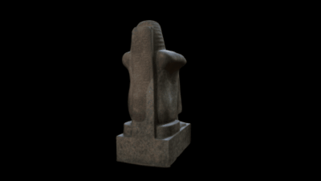

 

# 3D data for the statue of Roy

This repository holds data and images for the recreation of a 3D model for the statue of Roy.

Granodiorite squatting figure of Roy, High Priest of Amun during the reigns of Ramses II, Merenptah and Sety II, holding a Hathor-headed sistrum before, the dorsal pillar is inscribed with two vertical registers of hieroglyphs - invocations to Amun-Ra and Mut; lower section lost.

19th Dynasty, dating to circa 1220 BC. Found in Thebes, Egypt.

Height: 88 centimetres (Original) Height: 113 centimetres (Restored)

[British Museum Collection online](http://bit.ly/statueRy)

[Buy a resin cast.](http://www.britishmuseumshoponline.org/invt/cmcr60560)

# LICENSE

The contents of this repository are licensed under CC-BY-NC-SA in line with the @britishmuseum licensing policy. 

# Credits
Photographs and models by Daniel Pett <dpett@britishmuseum.org>, Digital Humanities Lead, British Museum

Made using a Nikon D5100 and Photoscan. The lighting conditions in the gallery where this is displayed make it quite hard to get a good image of the reverse.
